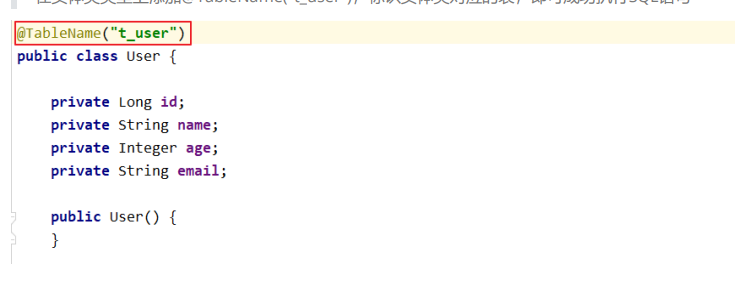
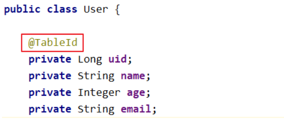
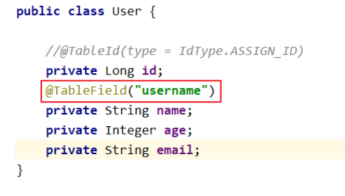

## MyBatisPlus的优点
- 无侵入：只做增强不做改变，引入它不会对现有工程产生影响，如丝般顺滑
- 损耗小：启动即会自动注入基本 CURD，性能基本无损耗，直接面向对象操作
- 强大的 CRUD 操作：内置通用 Mapper、通用 Service，仅仅通过少量配置即可实现单表大部分
- CRUD 操作，更有强大的条件构造器，满足各类使用需求
- 支持 Lambda 形式调用：通过 Lambda 表达式，方便的编写各类查询条件，无需再担心字段写错
- 支持主键自动生成：支持多达 4 种主键策略（内含分布式唯一 ID 生成器 - Sequence），可自由
配置，完美解决主键问题
- 支持 ActiveRecord 模式：支持 ActiveRecord 形式调用，实体类只需继承 Model 类即可进行强
大的 CRUD 操作
- 支持自定义全局通用操作：支持全局通用方法注入（ Write once, use anywhere ）
- 内置代码生成器：采用代码或者 Maven 插件可快速生成 Mapper 、 Model 、 Service 、
- Controller 层代码，支持模板引擎，更有超多自定义配置等您来使用
- 内置分页插件：基于 MyBatis 物理分页，开发者无需关心具体操作，配置好插件之后，写分页等
同于普通 List 查询
- 分页插件支持多种数据库：支持 MySQL、MariaDB、Oracle、DB2、H2、HSQL、SQLite、
Postgre、SQLServer 等多种数据库
- 内置性能分析插件：可输出 SQL 语句以及其执行时间，建议开发测试时启用该功能，能快速揪出
慢查询
- 内置全局拦截插件：提供全表 delete 、 update 操作智能分析阻断，也可自定义拦截规则，预防
误操作
# MyBatis-Plus使用
## 配置环境
配置pom.xml
```xml
<!--MybatisPlus-->
        <dependency>
            <groupId>com.baomidou</groupId>
            <artifactId>mybatis-plus-boot-starter</artifactId>
            <version>3.5.1</version>
        </dependency>
<!--        lombok用于简化开发-->
        <dependency>
            <groupId>org.projectlombok</groupId>
            <artifactId>lombok</artifactId>
            <optional>true</optional>
        </dependency>
<!--        mysql驱动-->
        <dependency>
            <groupId>mysql</groupId>
            <artifactId>mysql-connector-java</artifactId>
            <scope>runtime</scope>
        </dependency>
```
配置yml文件
```yml
spring:
#  配置数据源信息
  datasource:
#    配置数据源类型
    type: com.zaxxer.hikari.HikariDataSource
#    配置连接数据库的各个信息
    driver-class-name: com.mysql.cj.jdbc.Driver
    url: jdbc:mysql://localhost:3306/mybatis_plus?characterEncoding=utf-8&useSSL=false&serverTimezone=UTC
    username: root
    password: password
```
在Mapper接口中继承BaseMapper，相当于有了增删改查功能
```java
public interface UserMapper extends BaseMapper<User> {
}
```

启动类
```java
@SpringBootApplication
@MapperScan("com.atguigu.mybatisplus.mapper")
public class MybatisplusApplication {
public static void main(String[] args) {
SpringApplication.run(MybatisplusApplication.class, args);
}
}
```
添加实体
```java
@Data //lombok注解
public class User {
private Long id;
private String name;
private Integer age;
private String email;
}
```
添加mapper

注意：BaseMapper是MyBatis-Plus提供的模板mapper，其中包含了基本的CRUD方法，泛型为操作的
实体类型
```java
public interface UserMapper extends BaseMapper<User> {
}
```
添加service
```java
public interface UserService extends IService<User> {
}
```
添加serviceImpl
```java
@Service
public class UserServiceImpl extends ServiceImpl<UserMapper, User> implements UserService {

}
```
添加日志
```yml
# 配置MyBatis日志
mybatis-plus:
configuration:
log-impl: org.apache.ibatis.logging.stdout.StdOutImpl
```
## 常用注解
### @TableName
在使用MyBatis-Plus实现基本的CRUD时，我们并没有指定要操作的表，只是在
Mapper接口继承BaseMapper时，设置了泛型User，而操作的表为user表

由此得出结论，MyBatis-Plus在确定操作的表时，由BaseMapper的泛型决定，即实体类型决
定，且默认操作的表名和实体类型的类名一致

可以在实体类上添加TableName("")注解,括号里的就是数据库中表的名字


### TableId
MyBatis-Plus在实现CRUD时，会默认将id作为主键列，并在插入数据时，默认
基于雪花算法的策略生成id，但是当主键并不是id时，需要在实体类的主键上添加@TableId注解




#### @TableId的value属性

>若实体类中主键对应的属性为id，而表中表示主键的是字段uid
>此时需要通过@TableId注解的value属性，指定表中的主键字段，@TableId("uid")或
>@TableId(value="uid")
#### @TableId的type属性

值|描述
-|-|
IdType.ASSIGN_ID（默认） |基于雪花算法的策略生成数据id，与数据库id是否设置自增无关
IdType.AUTO |使用数据库的自增策略，注意，该类型请确保数据库设置了id自增，否则无效

配置全局主键策略

```yml
mybatis-plus:
configuration:
# 配置MyBatis日志
log-impl: org.apache.ibatis.logging.stdout.StdOutImpl
global-config:
db-config:
# 配置MyBatis-Plus操作表的默认前缀
table-prefix: t_
# 配置MyBatis-Plus的主键策略
id-type: auto

```
### @TableField
**情况1**

若实体类中的属性使用的是驼峰命名风格，而表中的字段使用的是下划线命名风格
例如实体类属性userName，表中字段user_name
此时MyBatis-Plus会自动将下划线命名风格转化为驼峰命名风格
相当于在MyBatis中配置

**情况2**

若实体类中的属性和表中的字段不满足情况1
例如实体类属性name，表中字段username
此时需要在实体类属性上使用@TableField("username")设置属性所对应的字段名



### @TableLogic

#### 逻辑删除
- 物理删除：真实删除，将对应数据从数据库中删除，之后查询不到此条被删除的数据
- 逻辑删除：假删除，将对应数据中代表是否被删除字段的状态修改为“被删除状态”，之后在数据库
中仍旧能看到此条数据记录
- 使用场景：可以进行数据恢复

#### 实现逻辑删除
>step1：数据库中创建逻辑删除状态列，设置默认值为0

>step2：实体类中添加逻辑删除属性


## 条件构造器和常用接口
### Wapper


- Wrapper ： 条件构造抽象类，最顶端父类
    - AbstractWrapper ： 用于查询条件封装，生成 sql 的 where 条件
        - QueryWrapper ： 查询条件封装
        - UpdateWrapper ： Update 条件封装
        - AbstractLambdaWrapper ： 使用Lambda 语法
            - LambdaQueryWrapper ：用于Lambda语法使用的查询Wrapper
            - LambdaUpdateWrapper ： Lambda 更新封装Wrapper

### QueryWrapper
```java
组装查询
@Test
public void test01(){
//查询用户名包含a，年龄在20到30之间，并且邮箱不为null的用户信息
//SELECT id,username AS name,age,email,is_deleted FROM t_user WHERE
is_deleted=0 AND (username LIKE ? AND age BETWEEN ? AND ? AND email IS NOT NULL)
QueryWrapper<User> queryWrapper = new QueryWrapper<>();
queryWrapper.like("username", "a")
.between("age", 20, 30)
.isNotNull("email");
List<User> list = userMapper.selectList(queryWrapper);
list.forEach(System.out::println);
}

组装排序
@Test
public void test02(){
//按年龄降序查询用户，如果年龄相同则按id升序排列
//SELECT id,username AS name,age,email,is_deleted FROM t_user WHERE
is_deleted=0 ORDER BY age DESC,id ASC
QueryWrapper<User> queryWrapper = new QueryWrapper<>();
queryWrapper
.orderByDesc("age")
.orderByAsc("id");
List<User> users = userMapper.selectList(queryWrapper);
users.forEach(System.out::println);
}
组装删除
@Test
public void test03(){
//删除email为空的用户
//DELETE FROM t_user WHERE (email IS NULL)
QueryWrapper<User> queryWrapper = new QueryWrapper<>();
queryWrapper.isNull("email");
//条件构造器也可以构建删除语句的条件
int result = userMapper.delete(queryWrapper);
System.out.println("受影响的行数：" + result);
}
组装select子句
@Test
public void test05() {
//查询用户信息的username和age字段
//SELECT username,age FROM t_user
QueryWrapper<User> queryWrapper = new QueryWrapper<>();
queryWrapper.select("username", "age");
//selectMaps()返回Map集合列表，通常配合select()使用，避免User对象中没有被查询到的列值
为null
List<Map<String, Object>> maps = userMapper.selectMaps(queryWrapper);
maps.forEach(System.out::println);
}


```


## MyBatisPlus分页插件

**创建配置类**
```java
@Configuration
//扫描mapper包
@MapperScan("com/example/mybatisplus/mapper")
public class MyBatisPlusConfig {
    @Bean
    public MybatisPlusInterceptor mybatisPlusInterceptor(){
        MybatisPlusInterceptor interceptor = new MybatisPlusInterceptor();
        interceptor.addInnerInterceptor(new PaginationInnerInterceptor(DbType.MYSQL));
        return interceptor;
    }
}
```
测试方法

```java
@Test
    public void testPage(){
        Page<User> page = new Page<>(1,3);
        userMapper.selectPage(page,null);
        System.out.println(page.getRecords());
    }

@Test
public void testPage(){
//设置分页参数
Page<User> page = new Page<>(1, 5);
userMapper.selectPage(page, null);
//获取分页数据
List<User> list = page.getRecords();
list.forEach(System.out::println);
System.out.println("当前页："+page.getCurrent());
System.out.println("每页显示的条数："+page.getSize());
System.out.println("总记录数："+page.getTotal());
System.out.println("总页数："+page.getPages());
System.out.println("是否有上一页："+page.hasPrevious());
System.out.println("是否有下一页："+page.hasNext());
}

```
### Xml自定义分页
UserMapper中自定义接口方法
```java
/**
* 根据年龄查询用户列表，分页显示
* @param page 分页对象,xml中可以从里面进行取值,传递参数 Page 即自动分页,必须放在第一位
* @param age 年龄
* @return
*/
I
Page<User> selectPageVo(@Param("page") Page<User> page, @Param("age")
Integer age);

```
UserMapper.xml中编写SQL
```xml
<!--SQL片段，记录基础字段-->
<sql id="BaseColumns">id,username,age,email</sql>
<!--IPage<User> selectPageVo(Page<User> page, Integer age);-->
<select id="selectPageVo" resultType="User">
SELECT <include refid="BaseColumns"></include> FROM t_user WHERE age = #
{age}
</select>
```


## 代码生成器

第一步引入依赖

```xml
<!--代码生成器-->
        <dependency>
            <groupId>com.baomidou</groupId>
            <artifactId>mybatis-plus-generator</artifactId>
            <version>3.5.1</version>
        </dependency>
        <dependency>
            <groupId>org.freemarker</groupId>
            <artifactId>freemarker</artifactId>
            <version>2.3.31</version>
        </dependency>
```
第二步执行方法
```java
 public static void main(String[] args) {
        FastAutoGenerator.create("jdbc:mysql://127.0.0.1:3306/mybatis_plus? characterEncoding=utf-8&userSSL=false", "root", "password")
                        .globalConfig(builder -> {
                            builder.author("atguigu") // 设置作者
//.enableSwagger() // 开启 swagger 模式
                                    .fileOverride() // 覆盖已生成文件
                                    .outputDir("D://mybatis_plus"); // 指定输出目录
                        })
                        .packageConfig(builder -> {
                            builder.parent("com.example") // 设置父包名
                                    .moduleName("mybatisplus") // 设置父包模块名
                                    .pathInfo(Collections.singletonMap(OutputFile.mapperXml, "D://mybatis_plus"));
// 设置mapperXml生成路径
                        })
                        .strategyConfig(builder -> {
                            builder.addInclude("user") // 设置需要生成的表名
                                    .addTablePrefix("t_", "c_"); // 设置过滤表前缀
                        })
                        .templateEngine(new FreemarkerTemplateEngine()) // 使用Freemarker引擎模板，默认的是Velocity引擎模板

                        .execute();
    }
```
